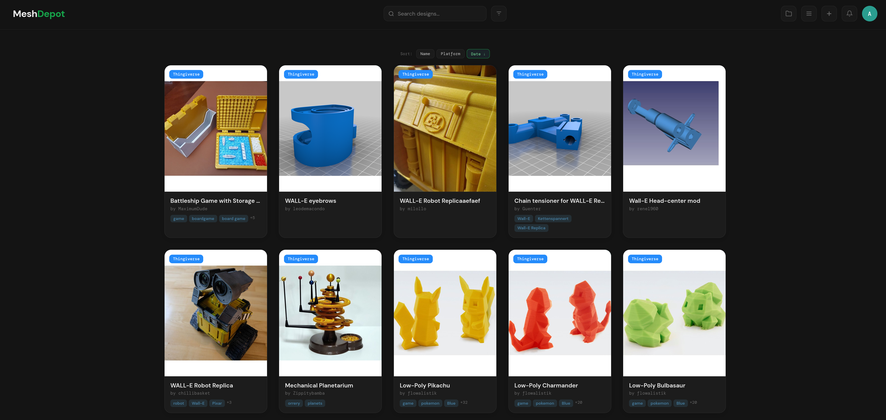
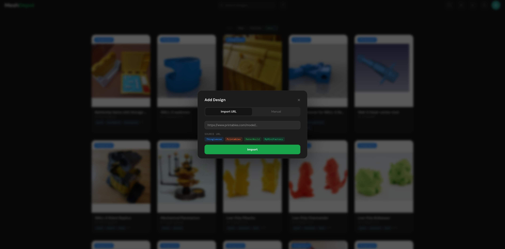
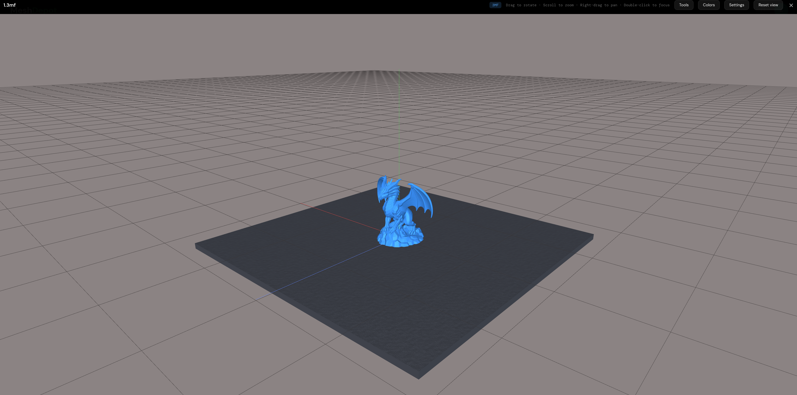
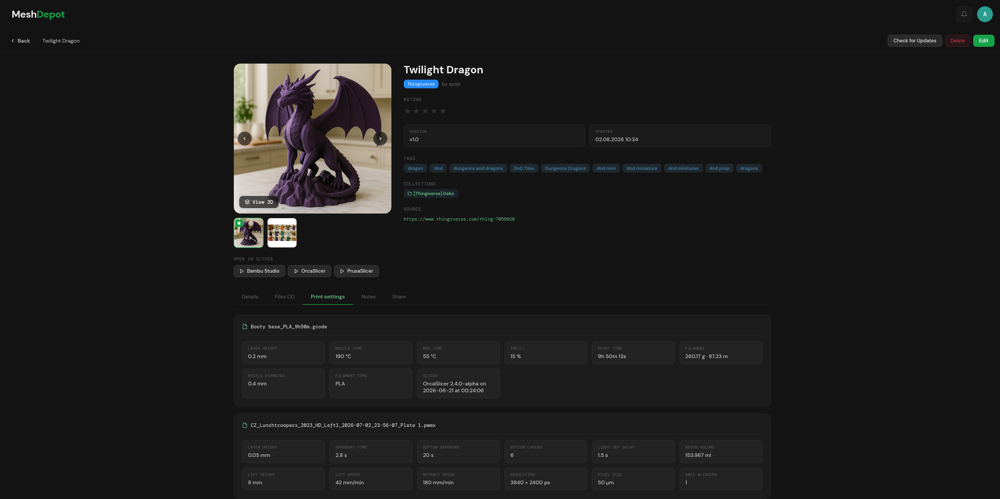
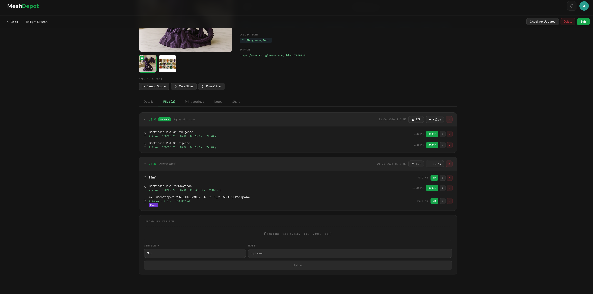

<div align="center">

# MeshDepot

**Your 3D-print library, on your own server.**

Import a design from Thingiverse, Printables, MakerWorld or MyMiniFactory by pasting its URL -
MeshDepot fetches the files, the pictures, the description and the print settings, and keeps them
even after the original disappears or changes.

Your own designs are just as welcome: upload them straight into the library, no platform and no
sync involved.

</div>

## At a glance

- **Import by URL** from Thingiverse, Printables, MakerWorld, MyMiniFactory, Cults3D and Thangs -
  files, cover, gallery, description, tags and author in one paste
- **Or import straight from the site** with the browser extension for Firefox, Chrome and
  Chromium - open a design, press import
- **Or let a connected account fill the library** - the collections you keep on the platform
  come in by themselves
- **Upload your own** designs just as easily, with no platform involved
- **View in the browser** - STL, OBJ, 3MF, G-code and resin formats, no plugin, no download
- **Measure** two points on a model in millimetres, and **capture** the view as a design picture
- **Split** a file that holds several objects into one STL per part
- **Read the print settings** out of sliced files: layer height, temperatures, filament, print time
- **Open in Bambu Studio, OrcaSlicer or PrusaSlicer** with one click
- **Versions instead of copies** - unchanged files are stored once, however many versions use them
- **Search, filter and tag** across the whole library, and group designs into collections
- **Keep designs current** - check the source platform for new versions, per design or on a
  schedule
- **Share** with another user, or hand out a link that needs no account and expires when you say
- **Several users**, each with their own library, platform accounts and storage quota
- **Notifications** in the app and by e-mail, per event and per user
- **Yours to shape** - light or dark, an accent colour, your own CSS, English or German
- **Runs on your server** - one container, SQLite, no cloud and no account anywhere

---

<!-- Screenshots go in docs/images/. Every image below is a placeholder: drop the file
     in with the name shown and it appears here. -->



---

## Why

A design you downloaded last year is a folder called `files (3)` somewhere in Downloads. The
pictures are gone, the print settings are gone, and the page you got it from may be gone too.
Platform accounts help until you use more than one - and then your library is spread across six
sites that all want you to stay.

MeshDepot puts all of it in one place that belongs to you: one library, one search, one backup.
Every design sits there with its picture, its files and its print settings visible at a glance -
sorted, tagged and grouped the way you want it, so finding something takes a look instead of a
dig through folders.

---

## What it does

### Import by URL

Paste a link, and the design lands in your library - files, cover, gallery, description, tags and
author. Nothing to unzip, nothing to rename.



Four platforms are supported.

| Platforms         |
|-------------------|
| **Thingiverse**   | 
| **Printables**    |
| **MakerWorld**    |
| **MyMiniFactory** |

Anything else - your own designs, a file from a friend, an old download - goes in as a **manual
design**: drop the files in, add a name and a picture, done.

### Import from the page you are on

A browser extension in `browser-extension/`, built for **Firefox** and for **Chrome and Chromium**.
On a model page it adds an import button: you press the site's own download button, and the
extension hands the resulting link to MeshDepot, which fetches the files itself. The page's title,
description, pictures and tags come along.

It uses the session you already have in that browser, so MeshDepot never sees a password, a token
or a 2FA code for those sites - which is also the way in for accounts whose login cannot be
automated at all. Works on MakerWorld, Printables, Thingiverse and MyMiniFactory; see
[browser-extension/README.md](browser-extension/README.md) for how to load and configure it.

### Look at the model before you print it

STL, OBJ and 3MF open in the browser. So do sliced files: **G-code** and the **resin formats**,
which are drawn from their own layer data.



It is more than a preview. **Measure** lets you click two points on the surface and reads out the
distance in millimetres - enough to check whether that bracket really fits before you spend six
hours printing it. **Take photo** captures the view, or a crop of it, and either downloads it or
adds it to the design as a picture, which is the quickest way to give one of your own designs a
cover. There is a print bed in the size of your printer, a grid, filament colours to preview a
multi-colour print, and for G-code a choice between lines, solid and a heat view.

For a sliced file, MeshDepot also reads out what it was sliced with - layer height, temperatures,
filament use, print time, exposure times - and shows it next to the file. You can see how a
G-code was set up without opening a slicer.



When you do want the slicer, one click hands the file to **Bambu Studio, OrcaSlicer or
PrusaSlicer**.

### Versions, not copies

Upload a new version of a file and the old one stays. Every version keeps its own file list, and
identical files are stored only once - a version that changed one part does not cost you a second
copy of the other twelve.



### Find things again

Once a library passes a few hundred designs, browsing stops working - so there are plenty of ways
to narrow it down. **Search** looks through names, descriptions and designers at once. **Filter**
by the platform a design came from, by any number of **tags** at the same time (a design has to
carry all of them, so two or three tags cut a big library down to a handful), by what other people
shared with you, and by the designs you once hid from the grid. **Sort** by name, platform or date,
in either direction, and **group** what belongs together into collections.

Colour-coded tags, grid or list, 5 to 1000 designs per page - and every filter is cleared again
with one click.

### Stay up to date

MeshDepot can check a design against the platform it came from and pull a new version if the
designer published one. Manually per design, in bulk, or quietly in the background on a schedule
you set.

If you have a platform account connected, it can also **mirror your collections there** - what
you collected on Thingiverse, Printables, MakerWorld or MyMiniFactory shows up here on its own.

### Share

Share a design with another user of your MeshDepot - they can view and download it, but not
change it.

Or hand out a **link that needs no account at all**. Whoever opens it sees the design and can
download the files, individually or all at once. You decide how many days the link stays alive,
and you can revoke it at any time; all your links are listed in one place with their expiry date.

### For everyone in the house

Multiple users, each with their own library, their own platform accounts and their own storage
quota. Admins get a panel for users, server-wide settings and storage.

Descriptions and names are **translated for display** when they come in a language you don't read
- the original stays untouched and is one click away. The interface itself speaks **English and
German**.

### Make it yours

Dark, light or follow the system. Pick an accent colour. And if that is not enough, write your own
**CSS** - it is stored with your account and follows you to every browser you log in from.

---

## Running it

One container, one volume. No database to set up, no cache server, nothing else to install.

```bash
git clone <this-repo> meshdepot && cd meshdepot
cp .env.example .env
echo "APP_KEY=$(openssl rand -base64 32)" >> .env
docker compose up --build -d
```

Then open **http://your-server:3100** and log in as `admin` / `admin` - the app asks you for a new
password right away.

That is all it takes inside your own network. For a proper domain and HTTPS, put your usual reverse
proxy in front of it - Caddy, nginx, Traefik, whatever you already run - and flip the two settings
that tell MeshDepot it is behind one. Nothing has to be built differently for it.

Everything the app owns lives in a single volume: the database, your files, the pictures. Back up
that one volume and you have backed up everything.

> Platform credentials are stored **encrypted**, with a key derived per user. They are used to
> download on your behalf and for nothing else.

---

## Good to know

**It downloads at a polite pace.** Every platform gets a cooldown between requests, and update
checks are spread out instead of firing all at once. This is deliberate: a library that hammers a
platform gets its account blocked.

**Automated downloading is your decision, and your risk.** Several platforms do not permit it in
their terms of service. MeshDepot signs in as you and downloads with your account, so it is your
account that carries the consequences - and those can go as far as it being restricted or banned.
Read the terms of any platform before you connect it, and leave it out if you would rather not
find out. No responsibility is taken for accounts that get limited, suspended or removed, nor for
anything else that follows from using this software.

**It is written for a homelab.** That is the setting MeshDepot is meant for: a network you
control - a home LAN, a VPN, a machine that is not reachable from outside. Everything about it
assumes that, and it has never been audited for anything else.

Publishing it to the open internet is a decision you make on your own. A reverse proxy gets you a
domain and a certificate; it does not turn the app into software written for the public. Think it
through before you do it, and know that I cannot take responsibility for the code if something
happens - not for a break-in, not for lost data, not for anything that follows.

**Two platforms do not work yet.** Thangs and Cults3D are visible in the app and marked as work in
progress; importing from them is not possible at the moment.

---

## License

MeshDepot is free software under the **GNU Affero General Public License, version 3** - the full
text is in [LICENSE](LICENSE).

Running it on your own server, changing it, and keeping those changes to yourself is explicitly
fine: that is what this software is for. The one obligation the AGPL adds over the ordinary GPL
concerns section 13 - if you run a modified version and let *other people* use it over a network,
those users must be able to get your modified source. Offering the app to your household or to
yourself is not that; running a public or paid service on a private fork is.

Contributions arrive under the same license. There is no contributor agreement to sign, which also
means the project cannot be relicensed later without asking everyone who contributed.

---

<div align="center">

*Self-hosted. Your files, your server, your rules.*

</div>
